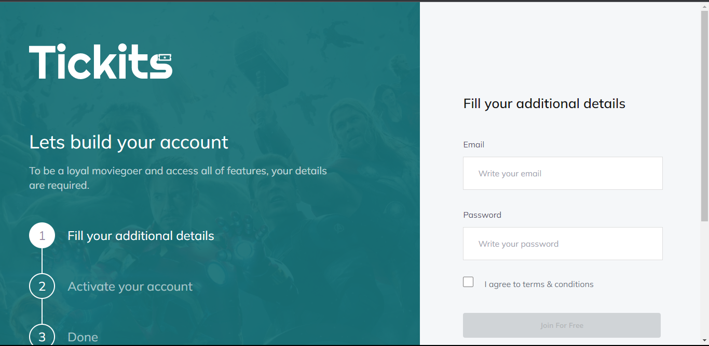
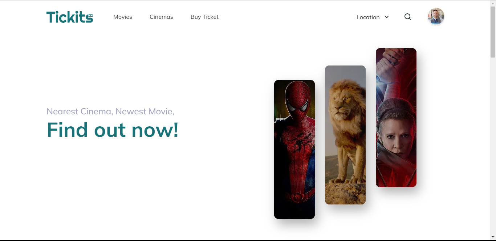
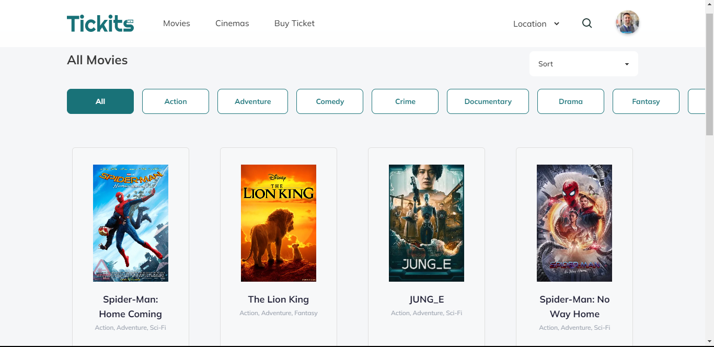
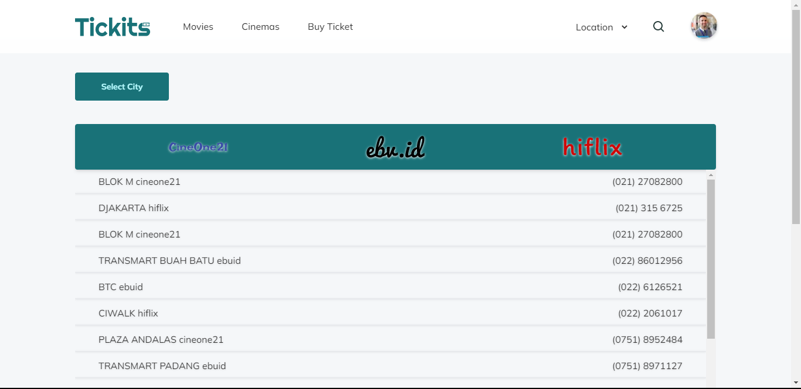
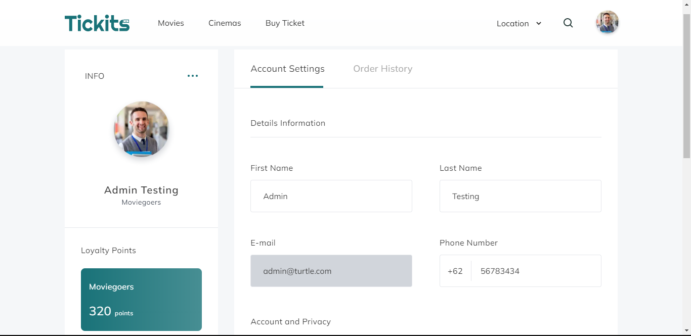
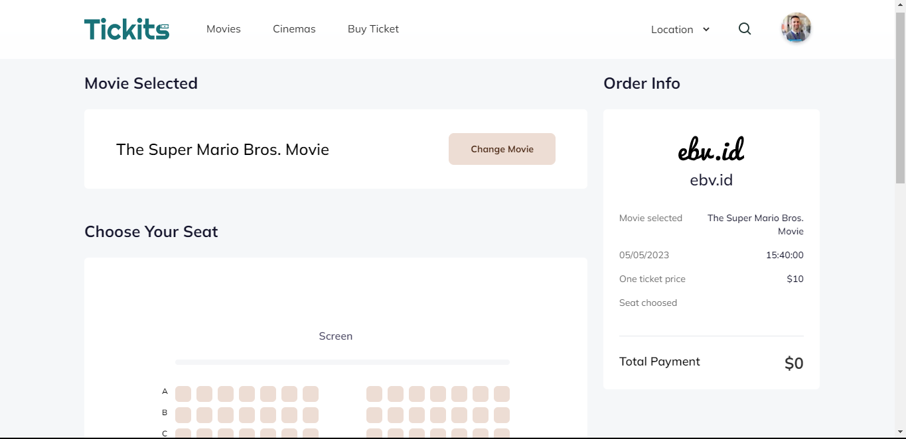
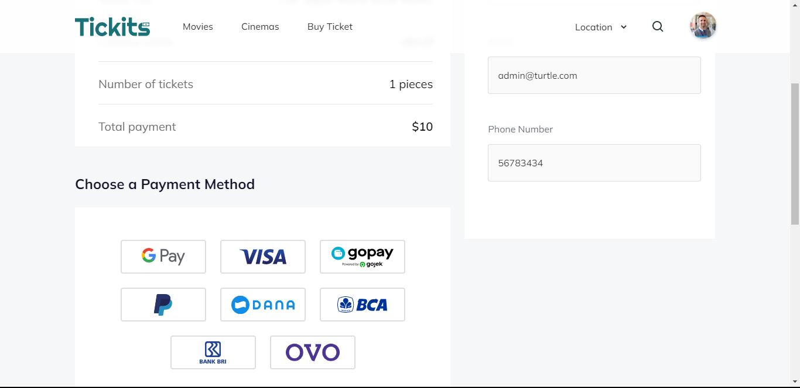
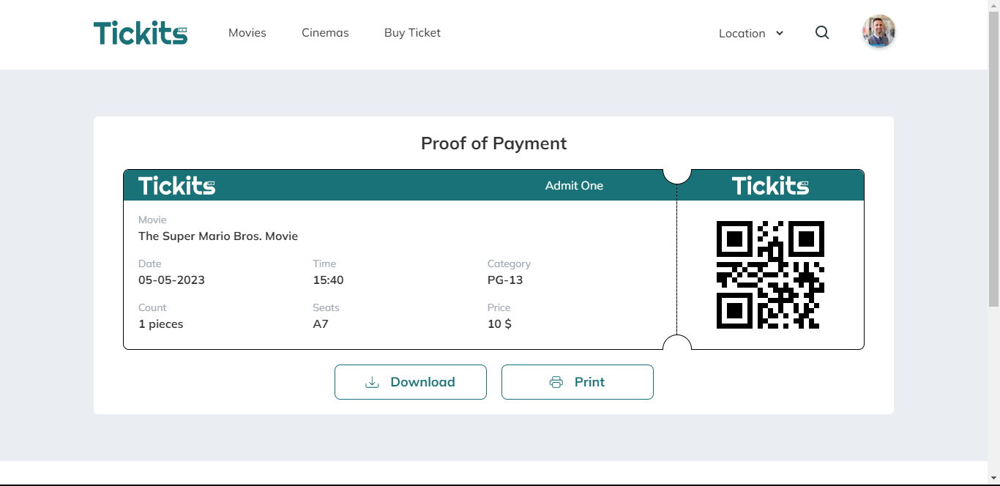

    

  <h2 align="center">Tickits</h2>

 

  

    <a href="https://tickits-fe.vercel.app/">View Demo</a>
    ·
    <a href="mailto:purapuraturtle69@gmail.com">Report Bug</a>
    ·
    <a href="mailto:purapuraturtle69@gmail.com">Request Feature</a>
  

## Tickits

Tickits is a web-based application for ticket booking movies and cinemas.

## Build With

This application is built using React.js, Next.js, Redux, axios, Lodash, Chart.js, React-Pin-Field, TailwindCSS, and DaisyUI.

## Features

### Public

- Login
- Register
- Forgot Password
- Booking Movie
- Payment Ticket
- Edit Profile
- Etc

## How to run the application

To run the application, follow these steps:

1. Clone this repository to your computer.
2. Open a terminal in the repository directory and run the `npm install` command to install all required dependencies.
3. After it finishes, run the `npm run dev` command to run the application.
4. Open a browser and visit `http://localhost:3000` to see the application.

## Contributions

If you would like to contribute to this project, please send a pull request to this repository. We greatly appreciate your contributions.

## Screenshots

## Contributors

<table>
  <tbody>
    <tr>
      <td align="center" valign="top" width="14.28%"><a href="https://github.com/afif-buchori"> <b>Afif Buchori</b></a> Project Manager</td>
      <td align="center" valign="top" width="14.28%"><a href="https://github.com/nyannss"> <b>Farhan Brillan W</b></a> Fullstack Developer</td>
      <td align="center" valign="top" width="14.28%"><a href="https://github.com/raihanirvana"> <b>Raihan Irvana</b></a> Front-end Developer</td>
      <td align="center" valign="top" width="14.28%"><a href="https://github.com/zikriaulia28"> <b>Zikri Aulia</b></a> Front-end Developer</td>
      <td align="center" valign="top" width="14.28%"><a href="https://github.com/abdulrosid21"> <b>Abdul Latif Rosid</b></a> Back-end Developer</td>
    </tr>
  </tbody>
</table>

## Related Project

- [tickits-be](https://github.com/purapuraturtle/tickits-be) - Rest API

## Report

Any error report you can pull request
or contact: <purapuraturtle69@gmail.com>
